# Multi-Modal Content Recommendation System

[](https://opensource.org/licenses/MIT) [](https://www.python.org/downloads/release/python-390/) [](https://pytorch.org/) [](https://flask.palletsprojects.com/) [](https://www.docker.com/)

A robust recommendation system combining text, images, and user behavior features with deep learning and rule-based filtering.

## 📌 Table of Contents

- [✨ Features](#-features)
- [🏗️ Architecture](#️-architecture)
- [📂 Project Structure](#-project-structure)
- [🚀 Getting Started](#-getting-started)
- [💻 Usage](#-usage)
- [⚙️ Configuration](#️-configuration)
- [🧠 Model Details](#-model-details)
- [📈 Evaluation](#-evaluation)
- [🔮 Future Enhancements](#-future-enhancements)
- [🤝 Contributing](#-contributing)
- [📜 License](#-license)

## ✨ Features

- **Multi-Modal Fusion**: Combines text (BERT), images (ResNet), and user features
- **Rule-Based Filtering**: Customizable business logic adjustments
- **Scalable Training**: Distributed training with PyTorch DDP
- **Production API**: Flask/Gunicorn REST API with Docker support
- **Robust Pipeline**: Comprehensive logging & error handling

## 🏗️ Architecture

```mermaid
graph TD
    subgraph Client["📱 Client"]
        A["✨ User App"] -->|HTTP Req| B["POST /recommend"]
    end

    subgraph API["🌐 API Service"]
        B --> C{"🛠️ Validate & Preprocess"}
        C --> D["📝 Text (BERT)"]
        C --> E["🖼️ Image (ResNet)"]
        C --> F["👤 User Features"]
        D --> H["🧠 MM Recommender"]
        E --> H
        F --> H
        H --> I["⚖️ Rule Filter"]
        I --> K["📈 Rating Prediction"]
    end

    subgraph Training["🏋️ Training"]
        L["📚 Data"] --> M["📥 Loader"]
        M --> N["🧹 Preprocess"]
        N --> O["🤖 DataLoader"]
        O --> P["🧠 Model Training"]
        P --> Q["💾 Checkpoint"]
    end
```



## 📂 Project Structure

```
multi_modal_recommendation/
├── data/               # Data processing modules
├── models/             # Model architectures
├── training/           # Training scripts
├── api/                # Flask API implementation
├── main.py             # Main entry point
├── requirements.txt    # Dependencies
└── Dockerfile          # Container configuration
```

## 🚀 Getting Started

### Prerequisites
- Python 3.9
- CUDA-enabled GPU (recommended)
- Docker (optional)

### Installation

``` bash
git clone https://github.com/your-username/multi-modal-recommendation.git
cd multi-modal-recommendation

python3 -m venv venv
source venv/bin/activate  # Linux/macOS
venv\Scripts\activate     # Windows

pip install -r requirements.txt
```

## 💻 Usage

### Training
``` bash
# Single-GPU training
python main.py --epochs 10 --batch_size 32 --data_path data/movies.csv

# Distributed training (2 GPUs)
python -m torch.distributed.launch --nproc_per_node=2 main.py --distributed
```

### API Deployment

```bash
# Local deployment
gunicorn --bind 0.0.0.0:5000 api.recommendation_api:app

# Docker deployment
docker build -t multi-modal-recommender .
docker run -p 5000:5000 multi-modal-recommender
```

## API Request Examples

### Multipart/form-data:

``` bash
curl -X POST -F "text=Space exploration movie" \
  -F "user_features=0.5,1.2,0.8,2.1,1.5" \
  -F "image=@poster.jpg" \
  http://localhost:5000/recommend
```

### JSON:

``` bash
curl -X POST -H "Content-Type: application/json" \
  -d '{"text": "Romantic comedy", "user_features": "0.5,1.8,2.2", "image_path": "data/movie.jpg"}' \
  http://localhost:5000/recommend
```

### Response:

``` json
{
  "predicted_rating": 4.2
}
```

## ⚙️ Configuration


## 🧠 Model Details

- **Text Encoder:** BERT-base (768d → 128d FC)
- **Image Encoder:** ResNet-18 (512d → 128d FC)
- **User Encoder:** FC Network (10d → 128d)
- **Fusion:** Concatenation + FC Network
- **Rules:** -10% rating for new users

## 📈 Evaluation

**Metric:** Root Mean Squared Error (RMSE)

```
Epoch 5/10 | Train Loss: 0.32 | Val Loss: 0.41
Best model saved with RMSE: 0.38
```

## 🔮 Future Enhancements

- Real-time learning pipeline
- Advanced feature engineering
- Explainable AI components
- Multi-modal attention mechanisms

## 📜 License
Distributed under the MIT License. See LICENSE for more information.
